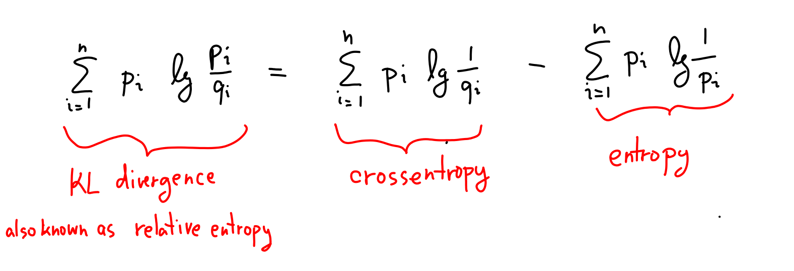
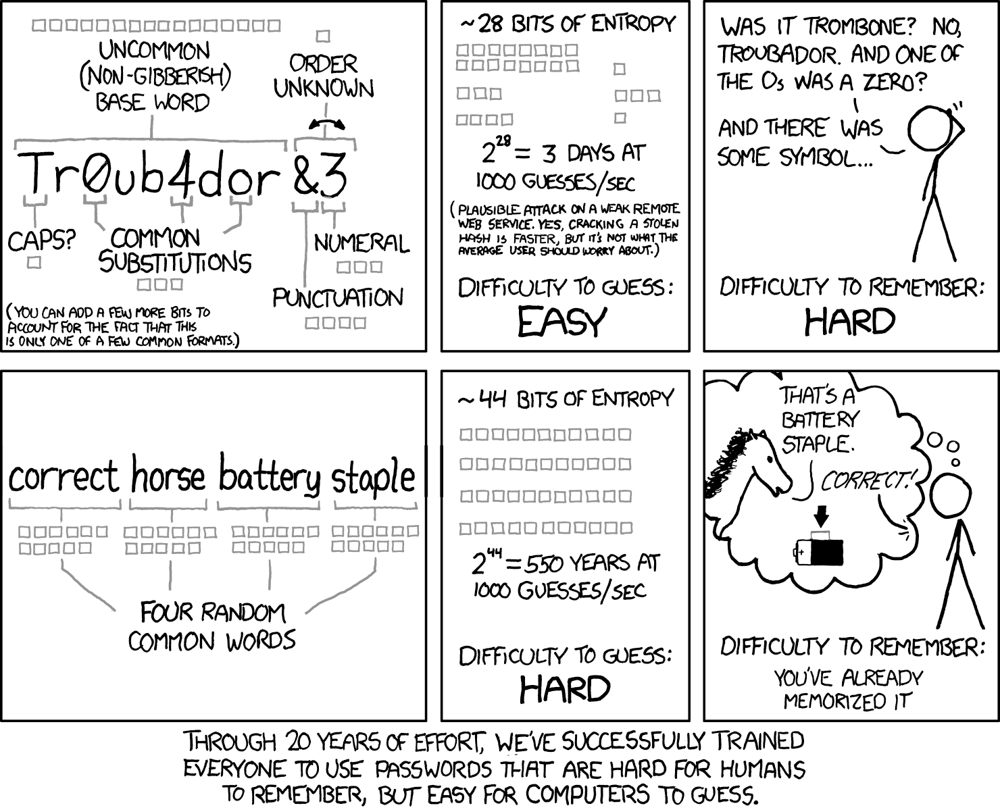

# KL properties & (cross-)entropy

In this chapter, we'll see how KL divergence can be split into two pieces called _cross-entropy_ and _entropy_. 

<KeyTakeaway>

Cross-entropy measures the average surprisal of model $q$ on data from $p$. When $p = q$, we call it entropy. 
</KeyTakeaway>

## KL = cross-entropy - entropy

Quick refresher: In the [previous chapter](01-kl_intro), we saw how KL divergence comes from repeatedly using Bayes' theorem with log-space updating:

<BayesSequenceLogWidget highlightSurprisals={true} />

Each step adds surprisals ($\log 1/p$) to track evidence.
Last time, we focused on the differences between surprisals to see how much evidence we got for each hypothesis. Our Bayesian detective just keeps adding up these differences.

But the detective could also add up the total surprisal for each hypothesis (green and orange numbers in the above widget), and then compare overall _Total surprisal_  values. This corresponds to writing KL divergence like this:

<Math id="cross-entropy-decomp" displayMode={true} math='
\underbrace{\sum_{i = 1}^n p_i \log \frac{p_i}{q_i}}_{D(p,q)}
 \;\;\;=\;\;\;
\underbrace{\sum_{i = 1}^n p_i \log \frac{1}{q_i}}_{H(p,q)}
 \;\;\;-\;\;\;
\underbrace{\sum_{i = 1}^n p_i \log \frac{1}{p_i}}_{H(p)}
'/>

These two pieces on the right are super important: $H(p,q)$ is called cross-entropy and $H(p)$ is entropy. Let's build intuition for what they mean. 

##  Cross-entropy 
Think of cross-entropy as: __how surprised you are on average when seeing data from $p$ while modeling it as $q$?__ 

Explore this in the widget below. The widget shows what happens when our Bayesian detective from the previous chapter keeps flipping her coin. The red dashed line is showing cross-entropy - the expected surprisal of the model $q$ as we keep flipping the coin with bias $p$. The orange line shows the entropy—this is the expected surprisal when both the model and actual bias are $p$. 
KL divergence is the difference between cross-entropy and entropy. Notice that the cross-entropy line is always above the entropy line (equivalently, KL divergence is always positive). 

If you let the widget run, you will also see a blue and a green curve - the actual surprisal measured by our detective in the flipping simulation. We could also say that these curves measure cross-entropy—it's the cross-entropy between the _empirical distribution_ $\hat{p}$ (the actual outcomes of the flips) and the model $q$ (blue curve) or $p$ (green curve). The empirical cross-entropies are tracking the dashed lines due to the [law of large numbers](https://en.wikipedia.org/wiki/Law_of_large_numbers). 

<CrossEntropySimulator />

Bottom line: _Better models are less surprised by the data and have smaller cross-entropy. KL divergence measures how far our model is from the best one._

## Entropy

The term $H(p) = H(p, p) = \sum_{i = 1}^n p_i \log 1 / p_i$ is a special case of cross-entropy called just plain _entropy_. It's the best possible cross-entropy you can get for distribution $p$—when you model it perfectly as itself.  

Intuitively, entropy tells you how much surprisal or uncertainty is baked into $p$. Even if you know you're flipping a fair coin and hence $p = q = \frac12$, you still don't know which way the coin will land. There's inherent uncertainty in that—the outcome still carries surprisal, even if you know the coin's bias. This is what entropy measures. 

The fair coin's entropy is <Math math = "H(\{\textsf{H: }1/2, \textsf{T: }1/2\}) = \frac12\cdot \log2 +  \frac12\cdot \log2 = 1" /> bit. 
But entropy can get way smaller than 1 bit. If you flip a biased coin where heads are very unlikely—say $p(\textsf{H} = 0.05)$—the entropy of the flip gets close to zero. Makes sense! Sure, if you happen to flip heads, that's super surprising ($\log 1/0.05 \approx 4.32$). However, most flips are boringly predictable tails, so the _average_ surprise gets less than 1 bit. You can check in the widget below that $H(\{\textsf{H}: 0.05, \textsf{T}: 0.95\}) \approx 0.29$ bits per flip. Entropy hits zero when one outcome has 100% probability. 

Entropy can also get way bigger than 1 bit. Rolling a die has entropy $\log_2(6) \approx 2.6$ bits. In general, a uniform distribution over $k$ options has entropy $\log_2 k$, which is the maximum entropy possible for $k$ options. Makes sense—you're most surprised on average when the distribution is, in a sense, most uncertain.  

<EntropyWidget numCategories={6} title="Entropy of die-rolling" />

<Expand headline = "Example: correct horse battery staple">
Here's an example. Let's say there are about <Math math="2^{11}" /> English words that can be described as 'common'. If you generate uniformly four such common words and make your password the concatenation of them, the total entropy of your password is thus going to be $44$ bits. That's because entropy is a special case of cross-entropy and is thus additive. 

Having a uniform distribution with 44 bits of entropy is just a different way of saying that we have a uniform distribution with $2^{44}$ possible outcomes. 
This comic wisely teaches us that this many possibilities make it a pretty secure password! Even if an adversary knows how we generated it, cracking it means they have to check about <Math math="2^{44}" /> passwords. 

</Expand>

## Relative entropy
KL divergence can be interpreted as the gap between cross-entropy and entropy. It tells us how far your average surprisal (cross-entropy) is from the best possible (entropy). 
That's why in some communities, people call KL divergence the _relative entropy_ between $p$ and $q$. <Footnote>Way better name than 'KL divergence' if you ask me. But 'KL divergence' is what most people use, so I guess we're stuck with it. </Footnote>

## What's next? 

We're getting the hang of KL divergence, cross-entropy, and entropy! Quick recap:

In the [next chapter](03-entropy_properties), we will do a recap of what kind of properties these functions have and then we are ready to get to the cool stuff. 

