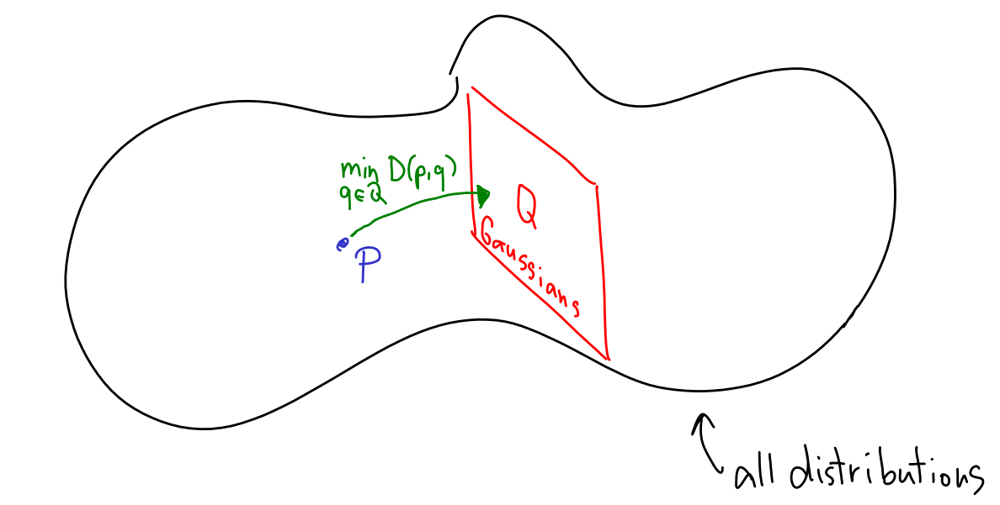
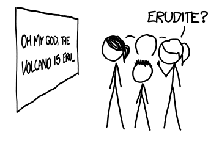

# Minimum KL $\rightarrow$ Maximum Likelihood 

In this chapter, we'll explore what happens when we minimize the KL divergence between two distributions. Specifically, we'll look at the following problem that often comes up in statistics and machine learning:

<Block>
We begin with a distribution $p$ that captures our best guess for the "truth". We want to replace it by a simpler distribution $q$ coming from a family of distributions $Q$. Which $q\in Q$ should we take? 
</Block>

We will solve this problem by taking $q \in Q$ that minimizes $D(p, q)$. If you remember the previous chapters, this should make a plenty of sense! We will also see how a special case of this approach is equivalent to the _maximum likelihood principle_ (MLE) in statistics.

Let's dive into the details!

<KeyTakeaway>
A good model $q$ for a distribution $p$ has small $D(p,q)$. This can be used to find good models, and a special case of this is the maximum likelihood principle. 
</KeyTakeaway>

## Example: Gaussian fit

Here's the example I want you to have in mind. Imagine we have some data—for instance, the 16 foot length measurements $X_1, \dots, X_{16}$ from [our statistics riddle](00-riddles#statistics). Assuming the order of the data points doesn't matter, it's convenient to represent them as an empirical distribution $p$, where each outcome is assigned a probability of $1/16$. This is what we call an _empirical distribution_. In some sense, this empirical distribution is the "best fit" for our data; it's the most precise distribution matching what we have observed. 

However, this is a terrible predictive model—it assigns zero probability to outcomes not present in the data! If we were to measure the 17th person's foot, then unless we get one of the 16 lengths we already seen, our model is going to be "infinitely surprised" by the new outcome, since it assigns zero probability for it.<Footnote>Remember, we have discussed in [the first chapter](01-kl_intro) how we can measure the surprisal of seeing the outcome $x$ as $\log \frac{1}{p(x)}$.</Footnote> We need a better model.

One common approach is to first identify a family of distributions $Q$ that we believe would be a good model for the data. Here, we might suspect that foot lengths follow a Gaussian distribution $N(\mu, \sigma^2)$.<Footnote>Why Gaussians? We'll see soon in the next few chapters.</Footnote> In this case, $Q$ would be the set of all Gaussian distributions with varying means and variances. 

In the following widget, you can see the KL divergence & cross-entropy between the empirical distribution $p_{empirical}$ and the model $q$. 

<GaussianFitWidget />

In the widget, we computed KL divergence like this: 
<Math displayMode={true} id = "gauss-KL" math = "D(p, N(\mu, \sigma^2)) = \sum_{i = 1}^{16} \frac{1}{16} \cdot \log \frac{1/16}{1/\sqrt{2\pi\sigma^2} \cdot e^{-(x_i - \mu)^2/(2\sigma^2)}}"/> 

This is a bit fishy, since the formula combines _probabilities_ for $p$ with _probability densities_ for $q$. Fortunately, we don't need to worry about this too much. The only weird consequence of this is that the resulting numbers are sometimes smaller than zero which we've seen can't happen if we just plug in probabilities to both. <Footnote>More discussion on this [here](05-max_entropy#continuous). </Footnote>

Remember: <Math displayMode={false} math = "D(p, N(\mu, \sigma^2)) = H(p, N(\mu, \sigma^2)) - H(p). " /> I.e., KL is the difference of cross-entropy and entropy. As <Math math = "H(p) = \log 16 = 4"/>, you can check that the two numbers in the widget above are always the same, up to a shift by 4. 

I want to persuade you that if we are pressed against the wall and have to come up with the best Gaussian fitting the data, we should choose the Gaussian with $\mu, \sigma$ minimizing  <Math displayMode={false} math = "D(p, N(\mu, \sigma^2))" />. Before arguing why this is sensible, I want to explain what this means in our scenario. 

We can compute the best $\mu, \sigma$ by minimizing the right-hand side of <EqRef id = "gauss-KL"/>. This looks daunting, but in this case it's not too bad. We can rewrite it like this: 

<Math displayMode={true} math = "\argmin_{\mu, \sigma} D(p, N(\mu, \sigma^2)) = \argmin_{\mu, \sigma} \left( \log \sqrt{2\pi \sigma^2} + \sum_{i = 1}^{16} \frac{1}{16} \cdot\frac{(x_i - \mu)^2}{2\sigma^2}\right)" />

To find the best $\mu$, you can notice that whatever $\sigma$, finding the $\mu$ minimizing the right-hand side boils down to minimizing the expression $\sum_{i = 1}^{16} (x_i - \mu)^2$. It turns out this is minimized by $\mu_{best} = \frac{1}{16} \cdot \sum_{i = 1}^{16} x_i$. This formula is called [_the sample mean_](https://en.wikipedia.org/wiki/Sample_mean_and_covariance). 

It may seem a bit underwhelming that we did all of this math just to compute the average of 16 numbers, but in a minute, we will see more interesting examples. We'll also revisit this problem [in a later chapter](07-machine_learning) and compute the formula for $\sigma$. 

## Why KL? 

I claim that minizing KL to find a model $q$ of data $p$ is a pretty good approach in general. Why?  

Recall that KL divergence is designed to measure how well a model $q$ approximates the true distribution $p$. More specifically, it is the rate of how quickly a Bayesian detective learns that the true distribution is $p$, not $q$. So, minimizing KL simply means selecting the best "imposter" that it takes the longest to separate from the truth. That's pretty reasonable to me!

Visually, I like to think of it like this. First, imagine a "potato" of all possible distributions. The empirical distribution $p$ is a single lonely point within it. Then, there's a subset of distributions $Q$ that we believe would be a good model for the data. Although KL divergence is not, technically speaking, a distance between distributions, because it's asymetric, it's close enough to think of it as a distance. Minimizing KL is then like finding the closest point in $Q$ to $p$; or, if you want, it's like projecting $p$ onto $Q$.

## Cross-entropy loss 

Let's write down our minimization formula, in its full glory: 
<Math id="kl_new_model_close" displayMode={true} math = "q_{\textrm{new}} = \argmin_{q\in Q} D(p, q) = \argmin_{q\in Q} \sum_x p(x) \cdot \log \frac{p(x)}{q(x)}" />

Here, $x$ ranges over all possible values in the distribution. In our Gaussian example, we have seen how the KL divergence is actually tracking the cross-entropy. That's because their difference is simply the entropy of the original distribution $p$, and whatever it is, it stays the same for different models $q$ that we may try out. 

This of course holds in general, which is why we can write:

{/*
 We can simplify this equation a bit. Let's remember that we can split the KL divergence into cross-entropy and entropy: 

<Math displayMode={true} math=" \underbrace{\sum_x p(x) \cdot \log \frac{p(x)}{q(x)}}_{\textrm{KL divergence}} = \underbrace{\sum_x p(x) \cdot \log \frac{1}{q(x)}}_{\textrm{Cross-entropy}} - \underbrace{\sum_x p(x) \cdot \log \frac{1}{p(x)}}_{\textrm{Entropy}}. " />

In this particular case, the _second_ term on the right - the entropy of $p$ - turns out to be completely irrelevant. Remember, we are optimizing over distributions $q \in Q$, and this term has the same value for all of them. So, __optimizing KL is the same as optimizing the cross-entropy__: 

Importantly, none of the following examples are using <EqRef id="cross-loss"/> as some kind of black box formula. That's because this equivalence is not really some kind of rocket science - saying 'we minimize KL divergence' and 'we optimize cross-entropy' is more like different accents. 

Minimizing cross-entropy is a super-important approach in statistics and machine learning. Let's go through several examples to see this in action. 

*/}

<Math id="cross-loss" displayMode={true} math = "q_{\textrm{new}} = \argmin_{q\in Q} D(p, q)  = \argmin_{q\in Q} H(p, q) =  \argmin_{q\in Q} \sum_x p(x) \cdot \log \frac{1}{q(x)}" />

In machine learning, we typically say that we find models of data _by minimizing the cross-entropy_. This is equivalent to minimizing KL divergence. It's good to know both -- Cross-entropy has a bit simpler formula, but KL divergence is a bit more fundamental which sometimes helps.<Footnote>See e.g. [training variational autoencoders](07-machine_learning#vae) later on, or [this blog post](https://blog.alexalemi.com/kl-is-all-you-need.html). </Footnote>

Now, let's solve two of our riddles by minimizing the KL divergence / cross-entropy. 
First, we return to our [Intelligence test riddle](00-riddles#intelligence) and see how neural networks are trained. 

<RiddleExplanation id = "intelligence">
Let's talk about how large language models (LLMs) are trained. Do you still remember the Intelligence test widget? 

<LetterPredictionWidget/>

This widget is essentially also how LLMs are trained. The task they are optimized for is that given a text snippet, they should output a probability distribution over what the next letter might be.<Footnote>In practice, it would be a _token_, not letter. If you don't know what a token is, don't worry. If you do, note that above widget converts token probabilities of GPT2/Llama 4 to letter probabilities. </Footnote> Basically, to train, you first collect many text snippets -- I collected some random Wikipedia text for the widget.<Footnote>Later, I found out I took all samples from topics that start with 'A'. If you played the game for a bit longer, you may have gotten bored a bit with all the Abraham Lincoln, anarchism, and Aristotle. Also, I am sorry for spoiling Atlas Shrugged... 😅 </Footnote> Then, consider some pair of a text snippet + the following letter, like this one: 

<Math displayMode={true} math = "(\textsf{The Abraham Lincoln National Cemetery is located in \_}, \,\, \textsf{E})"/>

Given the snippet, the neural net outputs the distribution predicting the next letter, like this:

<Math displayMode={true} math = "q_{LLM}(\textrm{letter} \,|\, \textsf{\dots is located in \_}) = \{\textsf{E}: 0.39,\, \textsf{t}: 0.34,\, \textsf{a}: 0.12, \dots\}"/>

We will now dig into an important aspect of the training process -- setting up the _loss function_. This is a function that takes the actual next letter (<Math math = "\textsf{E}"/>) and the distribution $q_{LLM}$. It outputs a single number -- how well the distribution is matching the truth. If the neural net nails it (<Math math = "q_{LLM} = \{\textsf{E}: 1.00 \}"/>), the loss should be zero, and worse guess means larger loss. 

Although training LLMs is pretty complicated, it's ultimately just using gradient descent to make the loss function as small as possible. So, we should better do a good job picking the right one! There are couple of ad-hoc choice that makes sense, like the $\ell_1$ or $\ell_2$ distance functions, but KL gives us a more fundamental way of doing this. 

Fortunately, it's not going to be much more complicated than fitting numbers with a Gaussian distribution. Once we work out what $p$ and $q$ should be, we will be done! 

The simplest way to set up $p$ and $q$ is like in the table below. To define $p$, we use the empirical distribution <Math math = "p_{\textrm{emp}}(\textrm{letter} | \textrm{snippet})" /> that simply gives $100\%$ probability to the actual letter following the snippet. For the model $q$, we take the distribution <Math math = "q_{LLM}"/> that the net outputs.

<SnippetDistributionTableWidget/>

To be precise, both $p$ and $q$ should not be just conditional distributions of letter given snippet, they should be the _joint distributions_ over what we see. So, the final definition of $p$ is 

<Math displayMode={true} math = "p(\textrm{snippet}, \textrm{letter}) = p_{\textrm{emp}}(\textrm{snippet}) \cdot p_{\textrm{emp}}(\textrm{letter} | \textrm{snippet})"/>

Here, the distribution <Math math = "p_{\textrm{emp}}(\textrm{snippet})"/> is simply the empirical, uniform distribution over the snippets. In our case, it would assign the probability of $\frac{1}{1000}$ to each of 1000 snippets I took from Wikipedia. 

The distribution $q$ is analogously this:
<Math displayMode={true} math = "q(\textrm{snippet}, \textrm{letter}) = p_{\textrm{emp}}(\textrm{snippet}) \cdot q_{LLM}(\textrm{letter} | \textrm{snippet})"/>

At this point, we are done. It remains to write down the KL formula and run the math autopilot to work out what exactly we are supposed to optimize. We write: 

<Math displayMode={true} math = "D(p, q) = \sum_{(\textrm{snippet}, \textrm{letter})} p_{\textrm{emp}}(\textrm{snippet}) \cdot p_{\textrm{emp}}(\textrm{letter} | \textrm{snippet}) \cdot \log \frac{p_{\textrm{emp}}(\textrm{snippet}) \cdot p_{\textrm{emp}}(\textrm{letter} | \textrm{snippet})}{p_{\textrm{emp}}(\textrm{snippet}) \cdot q_{LLM}(\textrm{letter} | \textrm{snippet})}"/>

where the sum goes over all pairs (snippet, letter) in our dataset. This is a mouthful, but we can simplify drastically. Plugging in <Math math = "p_{\textrm{emp}}(\textrm{snippet}) = 1/n"/> for $n$ the number of snippets, we get 
<Math displayMode={true} math = "D(p, q) = \sum_{\textrm{snippet}}  \frac{1}{n} \cdot \sum_{\textrm{letter}} p_{\textrm{emp}}(\textrm{letter} | \textrm{snippet}) \log \frac{p_{\textrm{emp}}(\textrm{letter} | \textrm{snippet})}{q_{LLM}(\textrm{letter} | \textrm{snippet})}"/>
and using that <Math math = "p_{\textrm{emp}}(\textrm{letter} | \textrm{snippet}) = 1"/> for the actual letter, and zero otherwise, we get: 
<Math displayMode={true} math = "D(p, q) = \sum_{\textrm{snippet}}  \frac{1}{n} \cdot \log \frac{1}{q_{LLM}(\textrm{actual letter} | \textrm{snippet})}"/>

The final formula is called the cross-entropy loss and it is as simple as it gets: To train a neural net, you look at the distribution it outputs on each snippet, take the probability <Math math = "q_{LLM}(\textrm{actual letter} | \textrm{snippet})" /> that the net assigns to the actual letter following the snippet, and compute the surprisal (i.e., $q \rightarrow \log 1/q$). You just keep summing surprisals for the snippets in your dataset. The average surprisal is the loss function that we are trying to push down during LLM training. 

So, no wonder that Llama 4 has probably beaten you in the game - __being good at the game is it's entire shtick__! All of the knowledge / intelligence in the [base model](https://toloka.ai/blog/base-llm-vs-instruction-tuned-llm/) happened to accumulate inside because it helps the model to be good at this game. 

In fact, this is a point I wanted to make when selecting three examples snippets for the table above. Since the text snippets I collected were cut at a random place, many of them are cut in the middle of some obvious English word, so they just test whether you know English. But, from time to time, guessing the next letter gets pretty hard, hence being _really really_ good at the game requires knowledge / intelligence. 

Here's more about the three examples snippets: In the first snippet, you have to know that Lincoln national cemetery is in $\textsf{Elwood}$. The next word in the second widget is $\textsf{Achilles}$. To guess that, you have to know Greek mythology. Llama guesses 't', because of $\textsf{Thetys}$ - the wife of Peleus referenced in the text by 'her'. Finally, the last snippet continues <Math math = "\textsf{virtue to selfishness. }" /> Predicting the next letter well requires knowing Rand's philosophy (though distinguishing between <Math math = "\textsf{virtue to selfishness}"/> and <Math math = "\textsf{vice to victimhood}"/> remains a hard call). 

Finally, here's a bit of historical trivia: Our letter prediction game comes from Claude Shannon, the father of information theory. He made the same experiment a few years after his invention (late 1940's). He found out that people can compress English text to about 1 bit per letter. <Footnote>Both Shannon and I made the following simplification. Instead of asking you to predict the whole distribution for the next letter, I computed your score as $\log k$, where $k$ is the number of guesses until the correct letter. We can view this as an 'optimistic' bound on what your true cross-entropy score would be. If you guessed the correct letter after $k$ trials, surely you would give that letter probability at most $1/k$ if I asked you for the whole distribution! </Footnote>

1 bit per letter is also roughly the score of LLMs, though old models like GPT-2 are somewhat worse and the new ones like Llama-4 used in the widget are better. As far as I can say, Claude Shannon's experiment was the first usage of the next-token prediction, 60+ years before it became cool!

</RiddleExplanation>

Let's also see how we can use cross-entropy score to grade experts from our [prediction riddle](00-riddles#predictions). 

<RiddleExplanation id="predictions">

Recall the riddle: We asked experts to predict future events—how do we score them?

<ImageGallery images={[{src: "00-introduction/questions.png", alt: "questions"}]} width="75%" />

### 🌈 Ideal KL score

To grade predictions, let $p = (p_1, \dots, p_n)$ be the true probabilities of the events we ask our experts about. Let's also focus on a particular expert and let $q$ be what they predicted. It for sure seems like a good idea to give the expert the score (loss) <Math displayMode={false} math="D(p,q)" />. 

This is what this chapter is about -- minimizing KL is a good way to go, since ultimately it's about finding a model that's the hardest to distinguish from the truth by Bayes' rule. 

If all $n$ events we are predicting are independent,<Footnote>They of course never are. </Footnote> the formula looks like this:

<Math displayMode={true} math="D(p,q) =
\sum_{i = 1}^n D(p_i, q_i)
= \sum_{i = 1}^n  \left(
    p_i\log\frac{p_i}{q_i} + (1-p_i)\log\frac{1-p_i}{1-q_i}
    \right)" />

Ok, there's a huge problem with this score. Can you spot it?

### Cross-entropy score

The problem: we have no clue what the "true" probabilities $p = (p_1, \dots, p_n)$ are! <Footnote> We could go down a philosophical rabbit hole about whether "true" probability even is even a meaningful concept. But let's not. </Footnote> Hence, we can't compute the ideal KL score. All we know is what actually happened - the ground-truth row in the picture above. Technically speaking, we know an empirical distribution $\hat{p}$ where each $\hat{p}_i$ is either 0 or 1—the whole distribution is concentrated on the single list of outcomes we saw.

So, we can only compute the KL score with $\hat{p}$, not $p$. Let's see how the formula looks like: 

<Math displayMode={true} math="
D(\hat{p}, q) =
\sum_{i = 1}^n  \left(
    \hat{p}_i\log\frac{\hat{p}_i}{q_i} + (1-\hat{p}_i)\log\frac{1-\hat{p}_i}{1-q_i}
    \right)
"/>

We can actually simplify the formula a bit. Either you can observe algebraically, that since <Math math = "\hat{p}_i \in \{0,1\}"/>, we have <Math math = "\hat{p}_i\log\frac{\hat{p}_i}{q_i} = \hat{p}_i\log\frac{1}{q_i}" /> (recall that <Math math = "0\log 0 = 0"/>). Or, much more fancily, you can notice that since the entropy of <Math math = "\hat{p}"/> is literally zero, the KL divergence equals cross-entropy:

<Math displayMode={true} math="
D(\hat{p}, q) = H(\hat{p}, q) =
\sum_{i = 1}^n  \left(
    \hat{p}_i\log\frac{1}{q_i} + (1-\hat{p}_i)\log\frac{1}{1-q_i}
    \right)
"/>

This is the _cross-entropy score_ used in forecasting tournaments. Forecasting community typically calls it the [Log-score](https://forecasting.wiki/wiki/Log_score), though. 

### 👶 Example

Try the log-score on our example! You can see how it really doesn't like the $99\%$-confidence failed prediction. On the other hand, it's too early to compare the second and the third expert. Another popular score is called Brier score and is computed as the mean squared error (i.e., if you predicted 0.8 probability and the event happens, your Brier score is $(1-0.8)^2 = 0.04$). Brier score does not really care whether your failed prediction had probability of $0.9$ or $0.9999$, so it doesn't penalize the first expert for his overconfidence. 

<ExpertRatingWidget
    title="Comparing Scoring Methods"
    showBrierScore={true}
  />

### ⚠️ Connection to the idealized score
Feel free to skip this one. 

Let's dig into how our cross-entropy score relates to our idealized KL score. 
I want you to imagine an obtruse probability space of what might have happened if butterflies flipped their wings a bit differently a few years ago. Only in this weird multiverse probability space we can easily talk about 'the true' probability $p_i$ that an event happens. In this space, $\hat{p}_i$s are random variables - Each $\hat{p}_i$ has value 1 with probability $p_i$, otherwise it's 0. Our cross-entropy score $H(\hat{p}, q)$ is also a random variable attaining different values in different worlds. 

So what's the expected cross-entropy score? Since $E_p[\hat{p}_i] = p_i$, [linearity of expectation](https://brilliant.org/wiki/linearity-of-expectation/) gives us:

<Math displayMode={true} math="
E_p[H(\hat{p}, q)] =
\sum_{i = 1}^n  \left(
    p_i\log\frac{1}{q_i} + (1-p_i)\log\frac{1}{1-q_i}
    \right)
    = H(p, q)
"/>

Nice! Give experts lots of questions, and by the law of large numbers, their cross-entropy score with $\hat{p}$ is close to the idealized cross-entropy score with $p$. 

This is analogous to how [in the cross-entropy widget in an earlier chapter](02-crossentropy#cross), the wiggly line is different each time you run the experiment (cross-entropy with empirical distribution depends on the actual flips), but it tracks the dashed red line (the rate given by cross-entropy with the underlying distribution). 

Now remember that <Math id="entropy-relation" displayMode={false} math="D(p,q) = H(p,q) - H(p)." /> Since $H(p)$ is a constant if we compare two experts $q_1, q_2$, we can observe that $D(p,q_1) < D(p, q_2)$ if and only if $H(p, q_1) < H(p, q_2)$. So, comparing two experts using their cross-entropy is the same as comparing them using their KL (which we otherwise can't compute). Putting everything together:

_In the long run, comparing experts by the log-score is the same as comparing them by KL with the 'true' underlying distribution!_

In other words, although we can't compute the idealized KL divergence $D(p, q)$, the log-score rule behaves the same in the long run. Understanding this also helps us to appreciate the flip side: We can trust the log-score (and any other score) only if we ask the experts many questions. Otherwise, what we can compute - $H(\hat{p}, q) = D(\hat{p}, q)$ - may be too noisy to use as an approximation for what we actually care about - $H(p,q)$, $D(p, q)$. 

<Expand headline="Example: Coin flipping">
Let's make this concrete. We flip a fair coin $N$ times ($p_1 = \dots = p_N = 1/2$). Expert 1 nails it ($q_1 = \dots = q_N = 1/2$), while Expert 2 is a bit off ($q'_1 = \dots = q'_N = 0.6$).

The idealized KL scores: 
<Math displayMode={true} math = "D(p, q) = D(p_1, q_1) = 0"/>
<Math displayMode={true} math = "D(p, q') = D(p_1, q'_1) \approx 0.03\cdot N"/>

We can't compute these scores in practice, because in practice we would not know $p$. However, we can compute cross-entropy. The expected cross-entropy score is this: 
<Math displayMode={true} math = "E[H(\hat{p}, q)] = H(p) + D(p, q) = N + 0 = N"/>
<Math displayMode={true} math = "E[H(\hat{p}, q')] = H(p) + D(p, q') = N + D(p_1, q'_1) \approx N + 0.03\cdot N"/>

For large $N$, the law of large numbers says that the actual score we measure - $H(\hat{p}, q)$ - is likely close to the expected score $H(p, q)$. In that case, since both scores shift by the same amount, cross-entropy still picks the best expert just like KL would. 

However, this only works _in the long run_. Disentangling $N$ from $N + 0.03\cdot N$ reliably would require about $N \approx 1000$ questions. That's why the original riddle does not try to pretend we can actually say which expert is good. With just 5 predictions, any scoring is going to be pretty noisy. 
</Expand>

</RiddleExplanation>

## 🕵️ Maximum likelihood principle 

We already understand that there's not much difference between minimizing cross-entropy or KL divergence between $p$ and $q$, whenever $p$ is fixed. There's one more equivalent way to think about this. Let's write the cross-entropy formula once more: 

<Math id="cross-loss" displayMode={true} math = "q_{\textrm{new}} =  \argmin_{q\in Q} H(p, q) =  \argmin_{q\in Q} \sum_x p(x) \cdot \log \frac{1}{q(x)}" />

In many scenarios, $p$ is literally just the uniform, empirical distribution over some data points $x_1, \dots, x_n$. In those cases, we can just write: 

<Math id="cross-loss-empirical" displayMode={true} math = "q_{\textrm{new}} =  \argmin_{q\in Q} \sum_{i = 1}^n \log \frac{1}{q(x_i)}" />

Another way to write this is:

<Math id="mle" displayMode={true} math = "q_{\textrm{new}} =  \argmin_{q\in Q} \prod_{i = 1}^n \frac{1}{q(x_i)} = \argmax_{q\in Q} \prod_{i = 1}^n q(x_i)" />

The expressions like $q(x_i)$ (probability a data point $x_i$ has been generated from a probabilistic model $q \in Q$) are typically called [_likelihoods_](https://en.wikipedia.org/wiki/Likelihood_function). The product $\prod_{i = 1}^n q(x_i)$ is the overall likelihood - it's the overall probability that the dataset $x_1, \dots, x_n$ was generated by the model $q$. So, __minimizing the cross-entropy with $q$ is equivalent to maximizing the likelihood of $q$__. 

The methodology of selecting $q$ that maximizes $\prod_{i = 1}^n q(x_i)$ is called the _maximum likelihood principle_ and it's considered as one of the most important cornerstones of statistics. We can now see that it's pretty much the same as our methodology of minimizing KL divergence (which is in fact a bit more general as it works also for non-uniform $p$). 

In a sense, this is not surprising at all. Let's remember how we defined KL divergence in the first chapter. It was all about the Bayesian detective trying to distinguish the truth from the imposter. But look, the detective accumulates the evidence literally by _multiplying her current probability distribution by the likelihoods_. KL divergence / cross-entropy / entropy is just a useful language to talk about the accumulated evidence, since it's often easier to talk about "summing stuff" instead of "multiplying stuff". 
So, the fact that minimizing cross-entropy is equivalent to maximizing the overall likelihood really just comes down to how we change our beliefs using Bayes' rule. 

In the context of statistics, it's more common to talk about maximum likelihood principle (and instead of cross-entropy, you may hear about the [log-likelihood](https://www.statlect.com/glossary/log-likelihood)). In the context of machine learning, it's more common to talk about cross-entropy / KL divergence (and instead of likelihoods, you may hear about  [perplexity](https://en.wikipedia.org/wiki/Perplexity)). 

There's a single versatile principle that underlies all the examples. Algebraically, we can think of it as: __If you have to choose a model for $p$, try $q$ with the smallest $D(p,q)$.__ But ultimately, it's more useful if you can, in your head, compile this principle down to Bayes' rule: __A good model is hard to distinguish from the truth by a Bayesian detective.__ <Footnote>This way, you can then generalize the principle from the context of standard (frequentist) statistics to the context of Bayesian statistics. In this branch of statistics, we would assume that we also have some prior distribution over different models $q \in Q$. This makes the math much cleaner (at the expense of having to specify this prior). Then, maximum likelihood principle gets replaced by the analogous [Maximum a posteriori](https://en.wikipedia.org/wiki/Maximum_a_posteriori_estimation) principle. 
In a sense, maximum likelihood is just a poor man's maximum a posteriori principle in which we crossed our fingers and assumed that the prior knowledge about different models $q$ got negligible due to a large number of data points. </Footnote>

## What's next? 

In the [next chapter](05-max_entropy), we will see what happens if we minimize the _first_ parameter in $D(p, q)$. 

