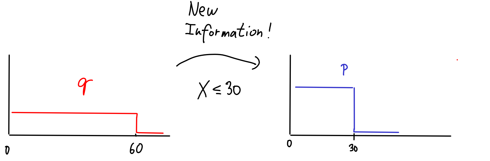
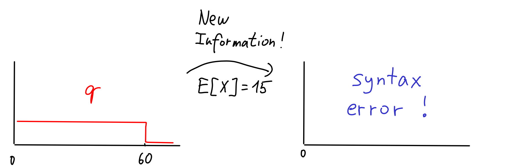
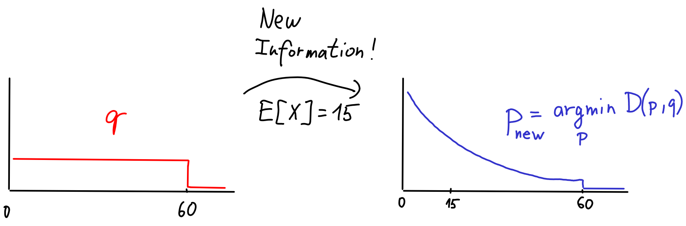
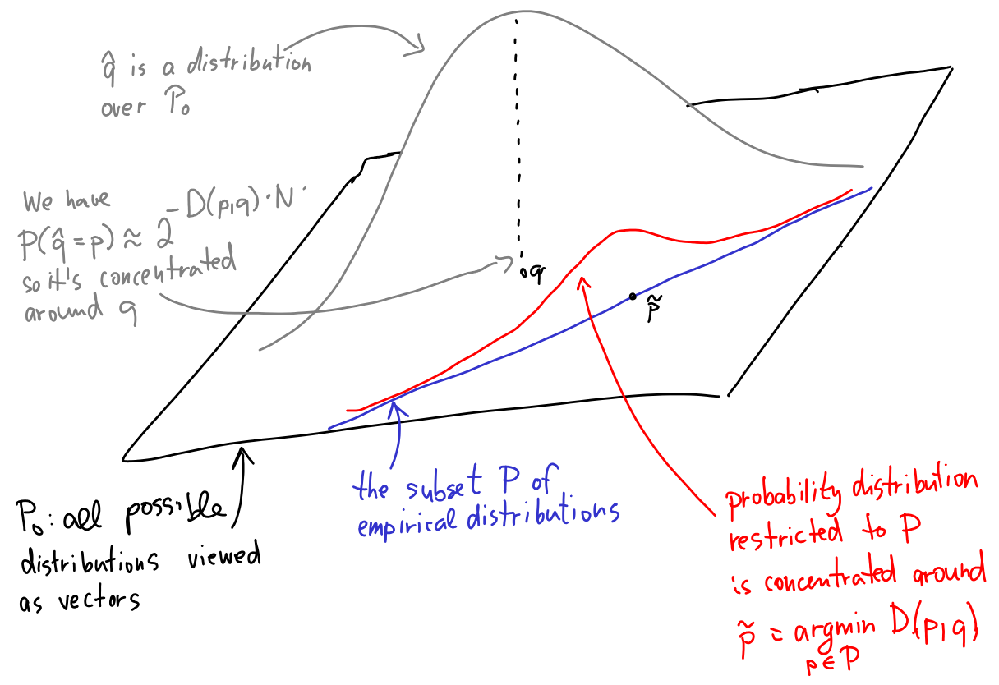
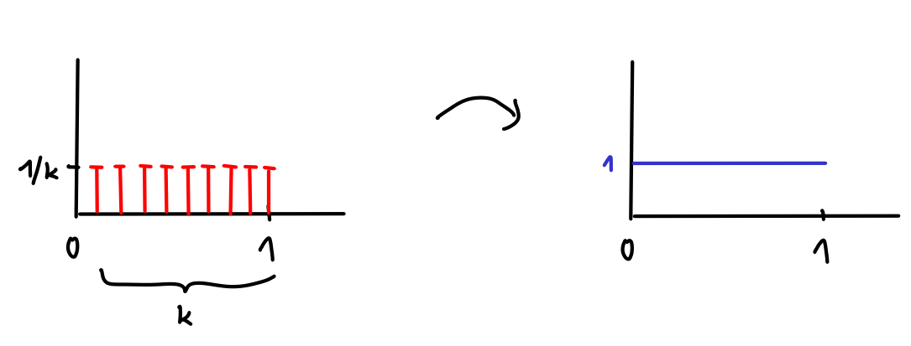
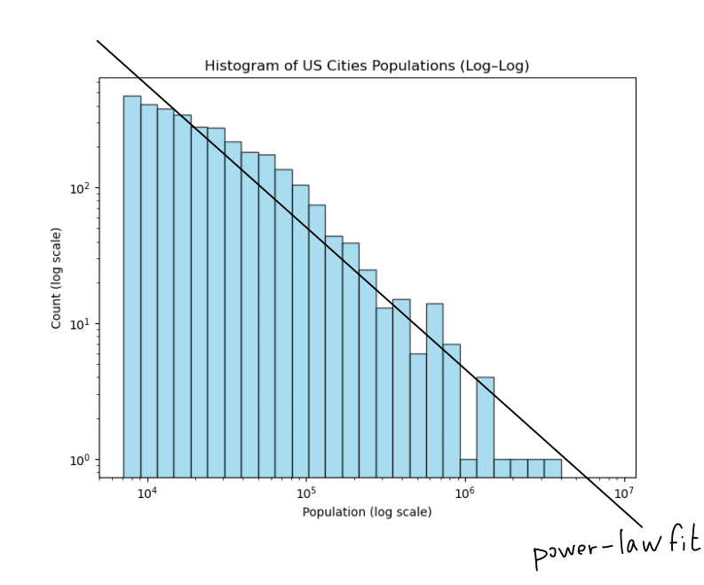
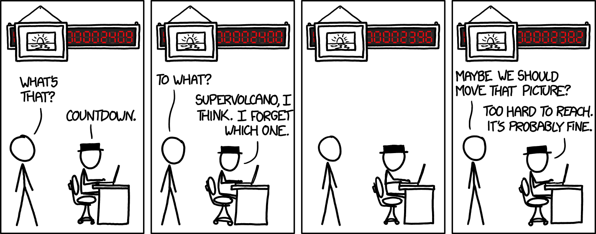
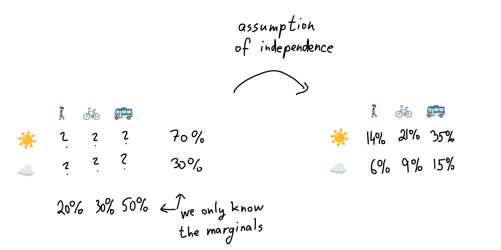

# Minimum KL $\rightarrow$ Maximum entropy 

In the [previous chapter](04-mle), we saw what happens when we minimize $q$ in the KL divergence $D(p, q)$. We used this to find the best model of data $p$. 

In this chapter, we will ponder the second question - what happens if we minimize $p$ in $D(p, q)$? This way, we will build the so-called _maximum entropy principle_ that guides us whenever we want to choose a good model distribuiton. 

<KeyTakeaway>
Max-entropy principle constructs the most generic distributions satifying some constraints. Most useful distributions are max-entropy for some parameter. 
</KeyTakeaway>

## Conditioning on steroids 

Suppose I want to determine a probability distribution modelling the random variable $X$ of how long it takes me to eat lunch. My initial (and very crude) model of $X$ might be a uniform distribution $q$ between <Math math="0" /> and <Math math="60" /> minutes.

Starting with this model, I can try to get some new information and condition on it to get a better model $p$. 

For example, let's say that after eating many lunches, I observe that I always finish after at most 30 minutes. I can turn this to a new information that $X \le 30$. I can condition on this information and get a better model:

Let's try again. I eat many more lunches, but this time I keep recording the average time it takes me to eat lunch. Say, it turns out to be 15 minutes. How do I change $q$ to reflect this new information? The probability theory gives a clear answer.

We simply can't do this. In probability theory, we can condition on events like $X \le 30$, i.e., facts that are true for some values that $X$ can attend, but not others. But now we would like to condition on $E[X] = 15$ which is not an event, just a fact that's true for some _distributions_ over $X$, but not others. 

The fun part is that we can use KL divergence to 'condition' on $E[X] = 15$. It turns out that the most reasonable way to account for the new information is to choose <Math math = "p_{\textrm{new}}" /> as the model minimizing KL divergence to $q$. That is, for the set $P$ of distributions $p$ with $E_p[X] = 15$, choose
<Math id="min-relative-entropy" displayMode={true} math = "p_{\textrm{new}} = \argmin_{p\in P} D(p, q)" />

In the example, <Math math = "p_{\textrm{new}}" /> happens to look like exponential distribution: 

This is sometimes called [the minimum relative entropy principle](resources#intermediate-resources). Why does this make sense? Intuitively, I want to find a distribution <Math math="p \in P" /> that would serve as the new best guess for what the truth is, while the old model distribution <Math math="q" /> remains as good a model of $p$ as possible. This is what we achieve by minimizing KL divergence $D(p, q)$.

Admittedly, this intuition may feel a bit shaky, as we typically prefer $p$ to represent the "true" distribution when using KL divergence, whereas here it's simply a new, improved, model. There's a more technical argument called [Wallis derivation](https://en.wikipedia.org/wiki/Principle_of_maximum_entropy#The_Wallis_derivation) that explains why we can derive minimum relative entropy as "conditioning on steroids" from the first principles.

<Expand headline="Detailed discussion of Wallis derivaiton" advanced={true}>
The following argument is a version of the so-called [Wallis derivation](https://en.wikipedia.org/wiki/Principle_of_maximum_entropy#The_Wallis_derivation). 
We will reformulate our setup slighlty to sidestep the "syntax-error" issue and to be able to condition on facts of the type "our model distribution should come from the set $P$". 

Imagine we start with some distribution $q$ and sample from it $n$ times. We'll use $\hat{q}$ to denote the empirical distribution of these samples. The Wallis trick is to realize that $\hat{q}$ is no longer a simple distribution, it's a distribution over distribution (also called a mixture distribution). For $\hat{q}$, it now makes sense to ask questions such as whether $\hat{q}$ belongs to some family of distributions $P$ (e.g., all distributions with an average of 15). 

Our plan is to imagine a very large $N$ and the process of generating $\hat{q}$ from $q$. We then condition the distribution of $\hat{q}$ on the fact that $\hat{q} \in P$ to obtain the posterior distribution. We will argue the following claim: _As $N$ approaches infinity, the posterior distribution will become concentrated on the distribution $p \in P$ that minimizes $D(p,q)$_. This provides the justification for the minimum relative entropy principle. The methodology is essentially equivalent to saying "If I keep my model $q$, but inexplicably, the data actually is from a set $P$, then I can as well model the data by <Math math = "\argmin_{p \in P} D(p,q) " />. 

Let's prove the claim.

First, a bit of notation: Think of $\hat{q}$ as a [random vector](https://en.wikipedia.org/wiki/Multivariate_random_variable) whose randomness stems from the choice of the $N$ samples from $q$. Let $P_0$ be the space of all random vectors <Footnote>More precisely, $P_0$ should be chosen as the space of all distributions where probabilities are multiples of $1/N$, but let's not get bogged down in technicalities.</Footnote> - we are given its subset $P$ from which the new model shall be picked. Here's a picture:

We now need to understand the distribution of $\hat{q}$, i.e., we want to understand the probability $P(\hat{q} = p)$ for $p \in P_0$. There are two ways to do this.

1.  We can write it down exactly (<Math math="P(\hat{q} = p) = {N \choose p_1N, \dots, p_kN}\cdot \prod_{i = 1}^k q_i ^ {p_i N}" />) and solve it (using Stirling's approximation, we have <Math math="P(\hat{q} = p) \approx 2^{H(p)\cdot N}" /> and thus <Math math="P(\hat{q} = p) \approx 2^{-D(p,q)\cdot N}" />).

2.  If you prefer to see the underlying algebra, we can revisit the [first chapter](01-kl_intro#expected-distinguishing-evidence) where our Bayesian friend was essentially trying to compute the probability we now need. More concretely, if our friend obtained $N$ samples and the empirical distribution was $p$, all the evidence supporting a hypothesis $q$ summed up to the value $N \cdot H(p, q)$. The meaning of this evidence is that the probability <Math math="P(\hat{q} = p)" /> must be proportional to <Math math="2^{-N \cdot H(p, q)}" />; we just don't know the normalization constant.

Now, with a bit of hand-waving, we can observe that the probability distribution of <Math math="\hat{q}" /> will be concentrated around the value of $q$ as $N$ approaches infinity, even though there's a nonzero probability that $\hat{q} \in P$. If that happens, we similarly find that the posterior distribution is concentrated around the value <Math math="\tilde{p} = \argmin_{p \in P} D(p,q)"/>. We conclude that in the limit of $N$ going to infinity, working with mixture distributions and conditioning on it being from $P$ is equivalent to simply replacing $q$ with <Math math="\argmin_{p \in P} D(p,q)"/>.

As a final note (unrelated to Wallis derivation), to justify the inuition that minimum relative entropy principle extends conditioning, we have to check carefully that conditioning is really a special case of minimizing KL. The fact that you have to prove (and it's a good exercise!) is this: If you have a joint distribution $p$ over two random variables $X,Y$ and learn that $Y = y$, there are two things you could do. 1) Define distribution $p_1$ by conditioning $p$ on $Y = y$. 2) Define distribution $p_2$ as <Math math = "\argmin_{p'} D(p', p)" />. You should prove that $p_1 = p_2$. 

</Expand>

{/*
<Expand headline = "Min relative entropy implies Bayes' updating" advanced={true}>
One more technical point. We should confirm that we can view classical updating as a special case of the min relative entropy principle. This justifies the intuition that minimum relative principle is "conditioning on steroids". 

Consider the general problem of updating after seeing evidence: We have a joint distribution <Math math = "p_{old}" /> over two random variables $X$ (which we're interested in) and $Y$ (representing possible evidence we might observe).
Then, we observe some evidence $Y=y$. We want to compute the new distribution <Math math = "p_{new}" /> that incorporates this observation. The rules of conditional probability say that <Math math = "p_{new}" /> should be $0$ for $Y \not= y$ and, for $Y = y$, it should be the conditional distribution of $p$ given $Y = y$.

The observation we can now make is that <Math math="p_{new} = \argmin_{p \in P} D(p, p_{old})" />, where $P$ is the set of distributions where $P(Y = y') = 0$ for $y' \ne y$<Footnote>The proof of this observation requires some rewriting, but in essence, it hinges on the fact that the distribution closest in KL to $p$ conditioned on $Y = y$ is... the same distribution. Really, nothing complicated is happening here; we are just saying that the new distribution should resemble the old one, merely rescaled so that probabilities sum to one.</Footnote>.
</Expand>
*/}

### The maximum entropy principle 

Let's delve deeper into the minimum relative entropy principle. A conceptual issue with it is that it only allows us to refine an existing model $q$ into a better model $p$. But how did we choose the initial model $q$ in the first place? It feels a bit like a chicken-and-egg dilemma.

Fortunately, there's usually a very natural choice for the simplest possible model $q$: the uniform distribution. This is the unique most 'even' distribution that assigns the same probability to every possible outcome. There's also a fancy name for using the uniform distribution as the safe-haven model in the absence of any relevant evidence: [the principle of indifference](https://en.wikipedia.org/wiki/Principle_of_indifference).

It would be highly interesting to understand what happens when we combine both principles together. That is, say that we start with the uniform distribution <Math math = "q_{\textrm{uniform}}" /> (say it's uniform over the set $\{1, \dots, k\}$). What happens if we find a better model <Math math = "p_{\textrm{new}} \in P" /> by minimizing KL divergence? Let's write it out:

<Math displayMode={true} math="p_{\textrm{new}} = \argmin_{p \in P} D(p,q_{\textrm{uniform}}) = \argmin_{p \in P}  \sum_{i = 1}^k p_i \log \frac{p_i}{ 1/k}" />

I am a one-trick pony, whenever I see KL divergence, I split it into cross-entropy and entropy:

<Math displayMode={true} math="D(p,q_\text{uniform}) = \underbrace{\sum_{i = 1}^k p_i\log \frac{1}{1/k}}_{\textrm{cross-entropy}} - \underbrace{\sum_{i = 1}^k p_i\log \frac{1}{p_i}}_{\textrm{entropy}}" />

In the previous chapter, it was the second term that was constant, now it's the first term: $\sum_{i = 1}^k p_i\log \frac{1}{1/k} = \log(k)$ does not depend on $p$, so minimizing KL divergence is equivalent to minimizing $-H(p)$. We get:

<Math displayMode={true} math="p_{\textrm{new}} = \argmin_{p \in P} D(p, q_{\textrm{uniform}}) = \argmax_{p\in P} H(p)" />

We've just derived what's known as the [maximum entropy principle](https://en.wikipedia.org/wiki/Principle_of_maximum_entropy): given a set $P$ of distributions to choose from, we should opt for the $p\in P$ that maximizes the entropy $H(p)$.

<Expand advanced={true} headline = "Working with Continuous Distributions">

Sometimes we need to use entropy and KL divergence for continuous distributions. For KL divergence, not much changes. We just replace the sum with an integral and write:
<Math displayMode={true} math = "D(p, q) = \int_x p(x) \log \frac{p(x)}{q(x)} dx. " />

For entropy, it's a bit trickier. To understand what's happening, let's remember what an integral intuitively represents. For example, a continuous uniform distribution over the interval $[0,1]$ is, in some sense, a limit of discrete distributions, where the $n$-th distribution in the sequence is the uniform distribution over <Math math = "\{\frac{1}{n}, \dots, \frac{n}{n}\}"/>. 

When we use integral formulas like the one above for KL divergence, it's justified by _convergence_: If we discretize the real line into buckets of length $1/k$ and compute KL divergence, then as $k$ increases, the discretized results will converge to the integral's value (unless $p,q$ are some truly wild functions).

The problem with entropy is that it doesn't converge. Indeed, the entropy of a uniform distribution with $k$ options is $\log k$. If $k$ goes to infinity, $\log k$ goes as well, hence the entropy of a continuous uniform distribution is infinite. This makes sense! If I sample a real number from [0,1], there is infinitely many bits of surprise in what I see. 

What does this mean for the principle of maximum entropy? If this principle was purely about entropy, we'd be in trouble. But, thankfully, we now understand that it is fundamentally about _minimizing KL divergence_ between $p$ and a model distribution, which, in the case of the max entropy principle, is the uniform distribution.

So, let's write down the formula for KL between $p$ and the uniform distribution. Since the uniform distribution does not exist for real numbers, let's use the interval $[-C, C]$ as the support; $C$ is some large number. We get: 
<Math displayMode={true} math = "D(p, q_{uniform}) = \int p(x) \log \frac{p(x)}{1/(2C)} dx = \log (2C) - \int p(x) \log \frac{1}{p(x)} dx." />
That is, in the continuous case, the minimum relative entropy principle boils down to maximizing the expression $\int p(x) \log \frac{1}{p(x)} dx$. This holds for any constant $C$, so we might as well use the principle also in the limit when $x$ ranges over all real numbers where the uniform distribution is not really well-defined.

So, after all this discussion, generalizing the minimum relative entropy principle to continuous distributions still boils down to replacing $\sum$ with $\int$ and maximizing $\int p(x) \log \frac{1}{p(x)} dx$. This integral expression is called [differential entropy](https://en.wikipedia.org/wiki/Differential_entropy) so it looks like it's basically the same thing as our entropy formula for discrete distributions. In the main text, I am also calling this expression implicitly "the entropy". 

But make no mistake: entropy is not differential entropy! The fact that we can use differential entropy in the max-entropy principle is a bit of a lucky coincidence. The key to not get confused is to understand that it is the _relative entropy_, i.e., KL divergence that generalizes to continuous distributions. Entropy is infinite. Thus, we can replace entropy with differential entropy in our maximum entropy principle _only because the underlying argument is ultimately about KL divergence to the uniform distribution_!    
</Expand>

## General form of maximum entropy distributions

Let's now dive a bit deeper into maximum entropy. We'll try to understand what maximum entropy distributions actually look like. For example, we will see soon how does the maximum entropy distribution with $E[X] = 15$ looks like. 

Here's what I want you to focus on, though. Let's not worry about concrete numbers like 15 too much. To get the most out of the max-entropy principle, we have to think about the questions a bit more abstractly, more like: _If I fix the value of $E[X]$, what shape will the max-entropy distribution have? 

For such a broad question, the answer turns out to be surprisingly straightforward! Before telling you the general answer, let's see a couple of examples. 

If we consider distributions with a fixed expectation $E[X] = \mu$ (and the domain is non-negative real numbers), the maximum entropy distribution is the *exponential distribution*. This distribution has the form <Math math = "p(x) \propto e^{-\lambda x}" />. Here, $\lambda$ is a parameter - fixing $E[X]$ to attain different values leads to different $\lambda$s. <Footnote>In this particular case, the precise shape of the distribution is <Math math = "p(x) = \frac{1}{\mu} e^{- x/\mu}" /> if you want $E_p[X] = \mu$. But let's not worry about that too much. The symbol $\propto$ means that the if you use the formula, the probabilities don't sum up to one / probability densities don't integrate to one. You would have to multiply all $p(x)$ by a certain normalization constant for this to happen. Notice that using $\propto$ is a lot like using odds instead of probabilities - we don't want to focus on the relatively uninteresting normalization factors to avoid clutter. </Footnote>

Another example: If we fix the values of both $E[X]$ and $E[X^2]$, the maximum entropy distribution is the *normal distribution*, where <Math math = "p(x) = \frac{1}{\sqrt{2\pi\sigma^2}} e^{-(x-\mu)^2/(2\sigma^2)}." /> To keep things clean, we can rewrite its shape as <Math math = "p(x) \propto e^{-\lambda_1 x - \lambda_2 x^2}" /> for some parameters $\lambda_1, \lambda_2$ that have to be worked out from what values we fix $E[X]$ and $E[X^2]$ to. 

Spot a pattern?

<Block headline= "General form of max entropy distributions">
Suppose we have a set of constraints $E[f_1(X)] = \alpha_1, \dots, E[f_m(X)] = \alpha_m$. Then, among all distributions that satisfy these constraints, the distribution $p$ with maximum entropy (if it exists) has the following shape:
<Math id="max-entropy-form" displayMode = {true} math = "p(x) \propto e^{\lambda_1 f_1(X) + \dots + \lambda_m f_m(X)}"/>
for some constants $\lambda_1, \dots, \lambda_m$.
</Block>
Notice that this general recipe doesn't tell us the exact values of $\lambda_1, \dots, \lambda_m$. Those depend on the specific values of $\alpha_1, \dots, \alpha_m$, while the general shape remains the same regardless of the $\alpha$ values. But don't get too hung up on the $\alpha$s and $\lambda$s. The key takeaway is that __the maximum entropy distribution looks like an exponential, with the "stuff we care about" in the exponent.__

Try building your own maximum entropy distribution on the interval $[0,1]$ by playing with $\lambda$ values:

<DistributionConstraintBuilder />

### Why? 

Let's build some intuition for this. Remember from [the previous chapter](04-mle) that the max-entropy principle is essentially about finding a distribution that is as close to uniform as possible, in the sense of minimizing KL divergence.

So, in what way are max-entropy distributions "close" to being uniform? Let's use the exponential distribution $p(x) \propto e^{-x}$ as an example. Say I independently sample two numbers from it, $x_1$ and $x_2$. Here's a little riddle: Is it more probable that I sample $x_1 = 10, x_2 = 20$ or that I sample $x_1' = 15, x_2' = 15$?

The answer is that both options have the same probability density. That's because $p(x_1)\cdot p(x_2) = e^{-x_1 - x_2}$. In our riddle, $x_1 + x_2 = x_1' + x_2'$, so both possibilities have a density proportional to $e^{-30}$. 

You can test it in the following widget. 

This property isn't exclusive to the exponential distribution; it holds for all max-entropy distributions that fit the form given by our formula <EqRef id="max-entropy-form" />. If you dare, the widget above also visualizes that if you sample $x_1, x_2, x_3$ from a Gaussian and fix the values of $x_1 + x_2 + x_3$ and $x_1^2 + x_2^2 + x_3^2$, the curve this defines (a circle) has constant density. 

<MaxEntropyVisualization />

In general, consider a distribution of the shape <Math math = "p(x) \propto e^{\lambda_1 f_1(x) + \dots + \lambda_m f_m(x)}" />. Now, imagine independently sampling a few points $x_1, \dots, x_k$ from that distribution. If you then tell me the values of the averages $a_1 = \frac{1}{k} \sum_{i = 1}^k f_1(x_i), \dots, a_m = \frac{1}{k} \sum_{i = 1}^k f_m(x_i)$, and I condition on this information, the conditional distribution over $x_1, \dots, x_k$ is actually uniform! This is because the probability density of any such tuple under our distribution $p$ is the same, equal to 
<Math displayMode={true} math = "p(x_1, \dots, x_k) \propto e^{\lambda_1 f_1(x_1) \,+\, \ldots \,+\, \lambda_m f_m(x_1)} \cdot \dots \cdot e^{\lambda_1 f_1(x_k) + \dots + \lambda_m f_m(x_k)} = e^{k(\lambda_1 a_1 + \dots + \lambda_m a_m)}. " /> 

You can imagine this as a generalization of the widget above. There's a super complicated space of all possible outcomes I can get by sampling $n$ times from my distribution. The max-entropy property says that if I draw a "contour" through outcomes that share the same empirical averages of the functions $f_1, \dots, f_m$, the conditional distribution is uniform on this contour. 

So, what's the takeaway? When you sample from max-entropy distributions, the experience is actually quite similar to sampling from a uniform distribution - the distribution over outcomes is uniform once you condition on the value of relevant properties! <Footnote>If we think of the number $n$ of samples as being very large, it gets even better. Due to the law of large numbers, we then know that with high probability, the empirical averages $\frac{1}{n} \sum_{i = 1}^n f_j(x_i)$ are going to be close to $E[f_j(X)]$. So, sampling many samples from max-entropy distributions is like sampling from the uniform distribution over all the "typical" instances satisfying $\frac{1}{n} \sum_{i = 1}^n f_j(x_i) \approx E[f_j(X)]$. </Footnote>

<Expand headline = "Proper derivation by Lagrange Multipliers" advanced = {true}>
There's an elegant derivation of the shape of max-entropy distributions using Lagrange multipliers. Feel free to skip this if you're not familiar with how they work. We'll only consider discrete distributions, say those with support $\{1, \dots, K\}$. 

We are solving the following optimization problem for $K$ variables $p_1, \dots, p_K$:

<Math displayMode={true} math = "\begin{aligned}
\text{VARIABLES:} &\quad p_1, \dots, p_K \\
\text{MAXIMIZE:} &\quad \sum_{i = 1}^K p_i \log \frac{1}{p_i}\\
\text{CONSTRAINTS:} & \quad \sum_{i = 1}^K p_i \cdot f_1(i) = \alpha_1\\
&\quad \vdots \\
&\quad \sum_{i = 1}^K p_i \cdot f_m(i) = \alpha_m\\
&\quad \sum_{i = 1}^K p_i = 1
\end{aligned}"/>

If there were no constraints, the problem would be simple! We'd just take the expression to maximize (the entropy) and set all partial derivatives with respect to $p_1, \dots, p_K$ to zero.

Fortunately, a technique called [Lagrange multipliers](https://en.wikipedia.org/wiki/Lagrange_multiplier) helps us here. It involves turning _hard_ constraints (like those in our problem) into _soft_ constraints. A soft-constraint version of our problem would be:

<Math displayMode={true} math = "\begin{aligned}
\text{VARIABLES:} &\quad p_1, \dots, p_K\\
\text{MAXIMIZE:} &\quad \sum_{i = 1}^K p_i \log \frac{1}{p_i}\\
&\quad - \lambda_1 \left(\sum_{i = 1}^K p_i \cdot f_1(i) - \alpha_1\right)\\
&\quad - \lambda_2 \left(\sum_{i = 1}^K p_i \cdot f_2(i) - \alpha_2\right)\\
&\quad - \dots \\
&\quad - \lambda_m \left(\sum_{i = 1}^K p_i \cdot f_m(i) - \alpha_m\right)\\
&\quad - \lambda_{m+1} \left(\sum_{i = 1}^K p_i - 1\right)
\end{aligned}"/>

What happens is that instead of requiring the solution to *exactly* satisfy all the constraints, we just say that we have to pay an additional cost for deviating from the target. The constants $\lambda_1, \dots, \lambda_{m+1}$ essentially tell us how important each constraint is—a large $\lambda_j > 0$ means that $\sum_{i = 1}^K p_i \cdot f_j(i) - \alpha_j$ had better be small! <Footnote>In fact, in this soft constraint formulation, we even get "paid" if <Math math = "\lambda_j \left( \sum_{i = 1}^K p_i \cdot f_j(i) - \alpha_j \right) < 0" />! </Footnote>

Long story short, Lagrange's method tells us that if someone provides a solution to our problem satisfying all $m+1$ _hard_ constraints, then we can find $m+1$ numbers $\lambda_1, \dots, \lambda_{m+1}$ such that this solution also solves the soft-constrained version. That's neat! We can now implement our plan of solving this by differentiation.

More precisely, let's use $\mathcal{L}$ for the soft-constrained objective:
$$
\mathcal{L}(p_1, \dots, p_K) = \sum_{i = 1}^K p_i \log \frac{1}{p_i}
- \lambda_1 \left(\sum_{i = 1}^K p_i \cdot f_1(i) - \alpha_1\right)
- \dots -
- \lambda_m \left(\sum_{i = 1}^K p_i \cdot f_m(i) - \alpha_m\right)
- \lambda_{m+1} \left(\sum_{i = 1}^K p_i - 1\right)
$$

We compute the derivative with respect to some $p_i$. Using the fact that $(p \log 1/p)' = -(p\log p)' = -\log p - 1$, we find that:

<Math displayMode={true} math = "\frac{\partial \mathcal L}{\partial p_i} = -\log p_i - 1 - \lambda_1 f_1(i) - \dots - \lambda_m f_m(i) - \lambda_{m+1}"/>

That's fantastic! If we now set <Math math = "\frac{\partial \mathcal L}{\partial p_i} = 0"/>, we get a formula for $p_i$:
<Math displayMode={true} math = "p_i = e^{ -1 - \lambda_1 f_1(i) - \dots - \lambda_m f_m(i) - \lambda_{m+1}}"/>
I find it more helpful to rewrite this as:
<Math displayMode={true} math = "p_i \propto e^{ - \lambda_1 f_1(i) - \dots - \lambda_m f_m(i)}"/>

I've just swept some proportionality constants under the rug: if we remember that probabilities have to sum up to 1, we've arrived at a shockingly simple formula!

We could, of course, generalize this formula to other discrete sets beyond $\{1, \dots, K\}$, yielding:

<Math displayMode={true} math = "p(x) \propto e^{ - \lambda_1 f_1(x) - \dots - \lambda_m f_m(x)}"/>

This is the general form of max-entropy distributions (except we formulated it with $+\lambda_j$ instead of $-\lambda_j$). 

The same formula also holds when the probability distribution is continuous, except that $p(x)$ is then technically a probability density. Also, the correct buzzword is no longer Lagrange multipliers, but its generalization called [calculus of variations](https://en.wikipedia.org/wiki/Calculus_of_variations). <Footnote>You also have to spend a few more years trying to understand the conditions under which it can be used. Even the Lagrange multiplier case is more tricky—for example, we've only found local extrema and saddle points, not necessarily the maximizer. In our case, we are fortunate that we minimize convex function over convex domain, where the local minimum is also the global minimum. </Footnote>

Now, this formula isn't the complete solution to our problem because it involves some magical constants $\lambda_1, \dots, \lambda_m$ that we don't know. To find their values, we have to go back to our constraints—remember those $m$ numbers $\alpha_1, \dots, \alpha_m$? We can use the conditions $E[f_j(x)] = \alpha_j$ to work out the precise shape of the distribution.
</Expand>

## Catalogue of examples

Let's go through the list of maximum-entropy distributions you might have encountered. In fact, most distributions used in practice are maximum entropy distributions for some specific choice of functions $f_1, \dots f_m$.

So, when you come across a distribution, the right question isn't really "Is this a max entropy distribution?" It's more like, "**For what parameters is this a max entropy distribution?**" For example, you can forget the exact formula for the Gaussian distribution—it's enough to remember that using it implies you believe the mean and variance are the most important parameters to consider.

Let's go through the examples with this in mind. Please, do skip whatever doesn't ring a bell, the list is long. 

Let's start with what happens if we don't have any constraints. 

<Expand headline = "No Constraints">
In the absence of any constraints, we have $p(x) \propto e^{0}$, which means the max entropy distribution is *uniform*. In other words, the maximum entropy principle is truly an extension of [the principle of indifference](04-mle#maximum-entropy-principle) that we discussed in the previous chapter.

One painful fact to keep in mind is that the uniform distribution doesn't always exist. Concretely, there's no uniform distribution over all real numbers.
</Expand>

### Logits, softmax, exponentials

If we believe the mean is an important parameter of a distribution (which is very typical), the max entropy principle states that the right family of distributions to work with are those with the shape:

<Math displayMode={true} id = "exponential" math = "p(x) \propto e^{\lambda x}"/>

This kind of distribution is known by many names, depending on its domain. Let's go through some instances!

<Expand headline = "Logits & Logistic function">

Let's first understand the simplest possible case of <EqRef id = "exponential"/>: when our distribution is supported on only two outcomes, $a_1, a_2$. Then, the max-entropy distribution takes the form:

<Math displayMode={true} math = "p(a_1) = \frac{e^{ \lambda a_1}}{e^{ \lambda a_1} + e^{ \lambda a_2}},\;\;\; p(a_2) = \frac{e^{\lambda a_2}}{e^{\lambda a_1} + e^{ \lambda a_2}}"/>

But it's actually better to write it like this:

<Math displayMode={true} math = "p(a_1) = \frac{1}{1 + e^{- \lambda (a_1 - a_2)}},\;\;\; p(a_2) = 1 - p(a_1)"/>

The function $\sigma(x) = 1/(1 + e^{-x})$ is called the [logistic function](https://en.wikipedia.org/wiki/Logistic_function)<Footnote>Or sometimes a sigmoid function. Apparently, [sigmoid function](https://en.wikipedia.org/wiki/Sigmoid_function) is a bit more general term.</Footnote> and the parameter $x$ is typically called a [logit](https://en.wikipedia.org/wiki/Logit). Using this function, our max-entropy distribution can be written as:

<Math displayMode={true} math = "p(a_1) = \sigma(\lambda (a_1 - a_2)),\;\;\; p(a_2) = 1 - \sigma(\lambda (a_1 - a_2))"/>

Here's my interpretation: if you want to talk about probabilities, but for some reason you prefer to work with general real numbers instead of numbers in $[0,1]$, you should use logits and apply the logistic transformation to convert them to probabilities. 

The parameter $\lambda$ in the formula corresponds to the choice of units in which we measure those logits. For instance, I often prefer to use the binary logarithm, which means measuring logits in bits.

<LogisticWidget 
  title="Sigmoid Function" 
  initialLambda={2}
  minLambda={-5}
  maxLambda={5}
/>

<Expand headline = "Example: Elo System">
The Elo system is used to assign ratings to players. Its fundamental idea is that when you have two players with Elos $a_1$ and $a_2$, you can estimate the probability that the first one wins from their difference $a_1 - a_2$. As we just discussed, the logistic function is the right way to convert the difference $a_1 - a_2$ to probability. 

Indeed, this is how Elo was designed: The interpretation of a chess Elo number is that the probability that the first player wins should be <Math math = "\frac{1}{1 + 10^{d / 400}}" />. <Footnote>It's more precisely the expected score of the first player due to the existence of draws.</Footnote> This is the logistic function with $\lambda = \frac{1}{400} \cdot \ln 10$.

Notice that without knowing the value of $\lambda$, the statement "the Elo difference between these two players is 200" is meaningless—we don't know how Elo is scaled. Yet, even without knowing $\lambda$, we understand the system pretty well: if the chance of an upset (i.e., the lower-rated player wins) is $p$ for $d = 200$, then for $d=400$ it's roughly $p^2$, for $d=600$ it's roughly $p^3$, and so on.
</Expand>

</Expand>

<Expand headline = "Softmax"> 

Let's stick with the max-entropy distribution for $E[X]$, i.e., the formula <EqRef id = "exponential"/>. However, now consider the more general case where our distribution is supported on a set of numbers $\{a_1, \dots, a_k\}$—these distributions are often called [categorical distributions](https://en.wikipedia.org/wiki/Categorical_distribution). In this scenario, the max entropy distribution is what's known as a *softmax* (or _softmin_) distribution—each number $a_i$ is chosen with probability:

<Math displayMode={true} math = "p_i \propto e^{\lambda a_i}. "/>

You can think of the softmax function (or softmin if $\lambda < 0$) as the generalization of the logistic function we just discussed—it's **the right way** to convert a bunch of numbers into probabilities. The numbers $a_i$ are still referred to as logits.

The parameter $1/|\lambda|$ is frequently called "temperature" because it behaves that way: at low temperatures, softmax is very orderly and acts much like the `max` function, whereas for high temperatures, the distribution becomes more chaotic, ultimately approaching the uniform distribution. <Footnote>The analogy with physics goes further. [Boltzmann distribution](https://en.wikipedia.org/wiki/Boltzmann_distribution) is essentially the softmax for energy, $1/\lambda$ in that distribution is the literal temperature. </Footnote> The chaos can be measured by entropy - you can see in the widget below how it decreases if you increase $|\lambda|$. 

<SoftmaxWidget values={[1, 3, 2, 5, 4]} title="Softmax Distribution Example" />

<Expand headline = "Example: Logits in Neural Networks">
Typical neural networks output probabilities. For example, a common neural network classifying images will output an entire probability distribution indicating whether a given picture is a dog/cat/horse/... instead of just a single prediction.
The issue with this is that often, most of these probabilities are extremely small, perhaps on the order of $10^{-10}$. That's because, given a picture of a dog, the neural network is usually quite certain it's not an octopus.

This makes it awkward to work directly with probabilities inside the network—it leads to all sorts of numerical and stability issues while running it (float precision) and even more while training it (vanishing gradients). So, neural networks instead try to predict logits, and the conversion to probabilities is simply the final layer of the network.

A nice bonus is that if you train the network using softmax with $\lambda = 1$, you can change the $\lambda$ parameter *after* training. For instance, setting $\lambda$ to infinity (temperature goes to zero) is equivalent to simply choosing the most probable option—this makes the model's output deterministic, which may be useful during deployment.

{/*There are also application for higher temperatures. For example, if you want to use LLM to solve a hard math problem, you might want to run it a million times to increase the probability the net solving it. But then you should probably run it at higher temperatures to make sure you want get the same thought process a million times in a row.

Notice how softmax allowed us to elegantly solve a problem that's so fuzzy that it's otherwise pretty hard to approach -- given a probability distribution $p$, how do we find distributions $p'$ that preserve as much as possible from $p$, yet they are more or less concentrated on the most probable values. */}
</Expand>

{/*
<Expand headline = "Modeling Pasta Consumption">

Theoretical economics tries to understand setups like this: Imagine there are $k$ substitutable products competing in the market—perhaps different shapes of pasta. We can observe how well each shape sells, but to draw conclusions from this data, we need some underlying model of what's happening. The basic model of rational consumers assumes each product $i$ has a certain utility $a_i$, and each customer simply buys the product with the highest utility. The problem with this model is that it predicts people should consistently buy only a single product—the one with the largest $a_i$.

How should we adapt this model to allow for non-trivial probability distributions? Well, we've seen that the natural "soft" generalization of taking a maximum is the softmax function, and this is indeed the function economists use to model such situations. There are more possible justifications for using this more complicated model—each customer might have a slightly different utility function, dislike repetition in their diet, etc. The parameter $\lambda$ in this model (the inverse temperature) then measures the strength of all these factors.

However, it's worth noting that one popular interpretation of softmax in behavioral economics is more sophisticated than "softmax seems natural, so let's go with it, whatever." The approach of the **theory of rational inattention** suggests that even if all agents are perfectly rational and have the same utilities, they still need to spend a non-trivial amount of time comparing different options and estimating their utility (at this point, stop thinking about pasta and instead consider buying a flat or a car). If you think about customers as solving an optimization problem that accounts for this, you end up with a type of optimization problem similar to [our derivation of max-entropy distributions](#intuition); under reasonable<Footnote>I.e., I forgot them.</Footnote> circumstances, you can derive the softmax distribution as the distribution of observed purchases.

</Expand>
*/}
</Expand>

<Expand headline = "Exponential/Geometric Distribution">
 

If the domain of the probability distribution from <EqRef id = "exponential"/> is non-negative integers or nonnegative reals, we get the so-called [geometric](https://en.wikipedia.org/wiki/Geometric_distribution) / [exponential](https://en.wikipedia.org/wiki/Exponential_distribution) distribution—another very basic and useful distribution. You should think of this as **the most natural** distribution on the domain of positive numbers (whether integers or reals).

Example: At the beginning of this chapter, we discussed how to model the distribution for how long I take my lunch. 
We started with the uniform distribution and then "conditioned" on the value of $E[X]$. This is exactly the same as using the max-entropy principle, thus the distribution we get this way is the exponential distribution.

{/*
<Footnote>
In practice, my guess would probably not have tail $p(x) \propto e^{-x}$, but a heavier tail, like <Math displayMode={false} math = "p(x) \propto e^{-\sqrt{x}}"/> or even $p(x) \propto 1/x^{C}$. Why? Well, notice how I am not sure about what the actual mean is. So, I should perhaps use a 2-layered model: 1) I sample your average lunch time $\mu$ from some distribution 2) I use exponential distribution with mean $\mu$.

How should I sample $\mu$ in the first step? Applying max-entropy principle again, perhaps I should sample it from exponential distribution, with mean being how long it takes me / average person to eat their lunch. If you crunch the numbers, the overall distribution that I will use as my input is going to have tails <Math displayMode={false} math = "p(x) \propto e^{-C\sqrt{x}}"/>. That is, the model is getting less sure that I won't see some really large numbers. Using power-law distribution in step 1) would lead to $p(x) \propto 1/x^{C}$.

This discussion is mostly meant to show what I love on the max entropy principle -- it enables us to rapidly operationalize and concretize our thought processes. Modelling real life is hard, but now we have a powerful tool that automatically builds concrete probabilistic models from vague thoughts like "there's two types of randomness, first in the average lunch time, and second in the variation around that average".
</Footnote>*/}

There's still an elephant in the room — the exponential distribution can't be normalized if the domain are _unbounded_ real numbers (i.e., both positive and negative). For that, we will need to use the Gaussian distribution. 
</Expand>

### 🔔 Gaussians

If we fix both mean and variance, the max-entropy distribution is Gaussian. 

<Expand headline="Gaussian Distribution">

If we believe that both the mean and the variance are interesting, the max entropy principle suggests that we should choose the function that has a quadratic function of $x$ in the exponent. This means it has the shape:
<Math displayMode={true} id = "gaussian" math = "p(x) \propto e^{-\lambda_1 x^2 - \lambda_2 x}"/>

{/*This gets more familiar if we rewrite the equation like this:
<Math displayMode={true} math = "p(x) = A e^{-B(x-C)^2}"/>
where $A,B,C$ are some constants chosen so that $p(x)$ integrates to $1$.*/}
This is the family of [normal (or Gaussian) distributions](https://en.wikipedia.org/wiki/Normal_distribution), and the density formula is usually written more precisely as <Math math = "p(x) = \frac{1}{2\pi\sigma^2} e^{-(x-\mu)^2/\sigma^2}" /> <Footnote>Notice that for a bounded domain, the probability function from <EqRef id = "gaussian" /> could also look like $p(x) \propto e^{x^2}$. That is, the distribution with the smallest probabilities in the middle and large probabilities at the edges is also a perfectly fine max-entropy distribution. However, a distribution with this shape is not normalizable to 1 if the domain is all real numbers. There, the only possible solution is the familiar bell-shaped curve. </Footnote>

I think this provides a good (partial) explanation for "why is there $x^2$ in Gaussian?" It simply means that the Gaussian is the **right** distribution to work with if you care about the mean and the variance. If you cared about the first four [moments](https://en.wikipedia.org/wiki/Moment_(mathematics)), the appropriate family of distributions would be those with four-degree polynomials in the exponent.

Often, I like to think about the Gaussian as the simplest possible distribution on real numbers. Neither the uniform distribution nor the exponential distribution can be normalized over the entire real line, so we salvage this by fixing the first two moments.

</Expand>

We can now revisit our [financial mathematics riddle](00-riddles#financial-mathematics) from the intro. 

<RiddleExplanation id="financial-mathematics">

In that riddle, we look at daily changes in S&P index (normalized as a so-called log-return $\log S_{i+1}/S_{i}$ for all consecutive daily values $S_i, S_{i+1}$) and plot them in a histogram in the following widget

<FinancialDistributionWidget showBTC={true} showSAP={true} />

You can observe that the Laplace distribution seems to fit the data better than the normal distribution, as measured by KL between the data and the model distribution, though it's pretty close at the beginning. 

### Laplace distribution

The Laplace distribution has the shape <Math math = "p(x) \propto e^{-\lambda |x-\mu|}" />. What's the meaning of this formula? We could think of it as the max-entropy distribution for $E[|X-\mu|]$, but there's a more illuminating way to understand it. The Laplace distribution with parameter $\lambda$ can be viewed as the result of the following process:

1.  Sample a variance $\sigma^2$ from the exponential distribution. 
2.  Output a sample from $N(\mu, \sigma^2)$.<Footnote>More precisely, if we want Laplace distribution <Math math = "p(x) \propto e^{-\lambda |x-\mu|}" />, we should sample $\sigma^2$ from exponential distribution <Math math = "p'(t) \propto e^{-(\lambda^2/2) \cdot t}"/>. Let me know if you know a simple proof of [this fact](https://math.stackexchange.com/questions/1175076/how-to-prove-laplace-distribution-is-scale-mixture-of-gaussians)!</Footnote>

### S&P stories

To understand how this helps explain our financial data, consider the following two stories for price fluctuations:

* For the S&P index, which represents an average of many large companies, there's some variance in the daily returns mostly because many (somewhat independent) trades happen that day, each making the value of the index slightly higher or lower. This is the setup for the central limit theorem, which predicts that the data will look approximately Gaussian.

* But now think about the index over a longer time period. Then the simplified model above might be too basic. There are definitely periods where not much happens, but also periods with large volatility. <Footnote> For example: US elections, financial crisis, pandemic hits, war starts, etc.</Footnote>

Perhaps we should try a more advanced two-layered model to predict the shape of our data: Maybe each month, we sample $\sigma^2$—the volatility for that month. Let's sample it from the max-entropy distribution for the expected volatility, i.e., exponential. Next, for the rest of the month, we sample from a Gaussian with that variance. As we just discussed, this two-layered process samples precisely from the Laplace distribution.

Put differently, while a Gaussian fit implicitly says "I'm pretty sure about each day's volatility and unsure about the fluctuation around the mean," Laplace is saying, "I'm uncertain both about the volatility and the actual fluctuation of the day." This explains why Gaussian fits near-term data reasonably well (volatility of the time period stays roughly the same), while more long-term data starts looking more and more like Laplace. 

## 🤔 Is Laplace a good model?

Not really. We now understand that by fitting Laplace, we are claiming that daily variance fluctuates according to exponential distribution. Let's see how daily variance of S&P looks like:

<VolatilityDistributionWidget />

Exponential is a good fit most of the time, but struggles to predict extreme events. As far as I know, people used distributions such as log-normal, or inverse-gamma to fit this kind of data.<Footnote> I am not sure if this is still relevant - nowadays they may just train a network. </Footnote> These distributions are more complicated and using max-entropy principle, we could map them to more complicated stories about how the data behaves. Most importantly, they are basically power-law fits (see below) that are less surprised by stock crashes / world wars / etc. 

{/*<Footnote>As far as I know, one standard way of modeling financial data is the Student-t distribution. I won't bore you with its formula, but I'll tell you it's the distribution you get from a similar process to how we arrived at Laplace; but instead of sampling $\sigma^2$ from the exponential distribution, you sample it from the so-called inverse gamma distribution. The Gamma distribution is itself a max-entropy distribution for fixing $E[X]$ and $E[\log X]$ (and inverse gamma distribution means we measure volatility by $1/\sigma^2$ instead of $\sigma^2$).
That is, the Student-t distribution takes our model a bit further and adds uncertainty about the _scale_ of the volatility. For example, maybe if you look far enough into the past, you start seeing some extreme events like world wars/the Great Depression/industrial revolution, so perhaps we should be open to power-law fits instead of exponential ones.</Footnote>*/}

The point of this riddle is not really to come up with the best model for the data, though. The point is to showcase how maximum entropy gives us a great language to talk about data fitting. It enables us to explore, build more and more complicated models of data, and still keep track of what our models stand for, where their weaknesses are, and how to improve them.  
</RiddleExplanation>

### Power-law

If you care about the _scale_ of a random variable, maximum entropy leads to so-called power-law distributions. 

<Expand headline ="Power Law Distributions">
Sometimes we care about random variables that span a large range of values. For example, the median US city has a population of about 2,400, but there are many cities with more than a million inhabitants (see the picture).

These situations are typically modeled by *power-law distributions*, where $p(x) \propto 1/x^C$ for some constant $C$. In the picture above, such a distribution would correspond to a straight line, so it would fit city populations quite well. From the perspective of maximum entropy, these distributions are simply max-entropy distributions when we fix $E[\log X]$. I.e., a power-law distribution is an exponential distribution into which we plug $\log X$ instead of $X$.

Whenever you use a power-law distribution, you're implicitly saying, "__The important thing to look at is not $X$, but $\log X$.__" In the case of cities, for example, it feels more sensible to classify them on a log-scale ($10^4$ – small, $10^5$ – medium, $10^6$ – large, $10^7$ – huge) instead of a normal scale ($10^5$ – small, $2 \cdot 10^5$ – medium, $3 \cdot 10^5$ – large, $4 \cdot 10^5$ – huge). 
</Expand>

And here's an application to our [XKCD riddle](00-riddles#xkcd):

<RiddleExplanation id="xkcd">

After four chapters developing the theory of KL divergence, we're finally ready to [dissect](https://www.goodreads.com/quotes/440683-explaining-a-joke-is-like-dissecting-a-frog-you-understand) the XKCD joke from [the list of riddles](00-riddles#xkcd).

It's all about how to choose a prior for the number on the wall. The first natural choice is simply the uniform distribution; that is, before looking at the wall, we model the number as a uniform random number with 14 decimal digits. A nice property of the uniform distribution is that each even after observing the right 8 digits,<Footnote>We actually also see a small piece of the leftmost digit in the comic, but let's forget this for simplicity.</Footnote> the distribution of the first 6 digits remain uniformly random. So, for that prior, the probability of all 6 hidden digits being zero is $1/10^6$—we are probably fine.

Uniform prior over $[0, 10^{14}]$ kind of sucks, though. If you look at various catastrophes, the average rate of how often they occur is all over the place -- $\sim 10^{15}$ seconds for $10\textrm{km}$-sized asteroids hitting Earth, $\sim 10^{10}$ for 9+ Richter-scale supervolcano eruption, and up to $\sim 10^{8}$ for AI doom. <Footnote>See [Precipice](https://books.ms/main/0F4823107289367C7A16C0AB1CF0F71D) by Toby Ord for estimations of these numbers. </Footnote> The uniform prior over $[0, L]$ however predicts that most catastrophes should happen at the roughly same rate of once per $L$ seconds!

Given all this, I'd argue for choosing the power-law distribution $p(x) \propto 1/x^\lambda$. In fact, I think that $p(x) \propto 1/x$ makes the most sense - that distribution corresponds to a uniform distribution over the _scales_. <Footnote>By this, I mean that this distribution satisfies <Math math = "\int_{10^1}^{10^2} \frac{1}{x} dx = \int_{10^2}^{10^3} \frac{1}{x} dx = \int_{10^3}^{10^4} \frac{1}{x} dx = \dots " />. You may know this kind of distriution from [the Benford's law](https://en.wikipedia.org/wiki/Benford%27s_law). </Footnote> This is also called the [log-uniform distribution](https://en.wikipedia.org/wiki/Reciprocal_distribution). The problem with $p(x) \propto 1/x$ is that we can't normalize this distribution if the domain is all real numbers, similarly to why we can't normalize the uniform distribution there. In our case, we can restrict the domain to integers between $0$ and $10^{14}$, so it's fine.

In the widget below, you can check out that the posterior probabbility that all hidden digits are zero becomes about $99.99\%$ under the new prior! Here's how to think about this: For a four-digit number, the probability it ends with $2382$ (and zeros are just padding) is about $1/10^5$. But for an eight-digit number, the probability it ends with $00002382$ is about $1/10^9$. So, if the number $X$ under the image is a "random four-digit" number, the evidence is much less suprising than if $X$ is a "random 9-digit number". 

In the widget below, the prior power-law distribution is binned into 14 bins between powers of 10. The Likelihood bar shows for each bin the probability that if a number sampled from the prior happens to be from that bin, it satisfies the revealed evidence about its digits. This is what goes into Bayes' rule that essentially multiplies the numbers in the first two tabs and normalizes them to get the posterior in the final tab. 

<XKCDCountdownWidget />

{/*
<Expand advance = {true} headline = "More plots for log-uniform prior">
The plot below shows the whole posterior distribution if we start with the log-uniform prior (on the left) and condition on the last digits of $x$ being "00002382". We grouped $x$-values into bins between $10^1, 10^{1.5}, 10^2, \dots$

As in the widget, almost all the probability is now concentrated on a single outcome—$x_0 = 2382$. That makes sense: in the prior, it had probability $p(x_0) \propto 1/x_0 \approx 5 \cdot 10^{-4}$, while the next most likely outcome—$x_1 = 100002382$ had probability $p(x_1) \propto 1/x_1 \approx 10^{-8}$. That is, the probability of $x_1$ was $10^{-4}$ times smaller in the prior.

But also notice is that the posterior distribution still looks uniform for numbers $>10^9$. This also makes sense—for large numbers, their last few digits are like a coin flip, so learning them doesn't significantly change things, and thus the posterior remains uniform there.
</Expand>
*/}

The point is that the max-entropy principle gives us a language to talk about different priors and what they stand for. If the very natural log-uniform prior says we are screwed with probability $> 0.999$, it's time to look behind the picture. 
</RiddleExplanation>

### 🔢 Other Examples

A few more advanced examples, you probably want to skip them.  

<Expand advanced = {true} headline ="Assuming Independence">
An important property of entropy that [we mentioned earlier](03-entropy_properties#additivity) is its _subadditivity_: If you have a joint distribution $r$ with marginals $p,q$, then $H(r) \le H(p) + H(q)$. 

The implication for the max-entropy principle is this: Imagine you're working with a joint distribution and you know its two marginals $p,q$. Then, the maximum entropy principle tells us that the max-entropy joint distribution with these two marginals is the independent, product distribution.

Whenever people model things using probability distributions, they often assume that certain distributions / random variables are independent if they don't know what the dependence between them should look like. We can think of this as a special case of using the maximum entropy principle.

</Expand>

<Expand advanced={true} headline ="Beta Distribution">
Our coin-flipping riddle from the [intro](01-kl_intro) was a bit silly - we somehow assumed that our coin was either fair, or 75/25 biased, but nothing else was possible. In reality, any bias $p$ is plausible, so a Bayesian detective would work with a distribution over biases with domain $[0,1]$, and she would update the whole distribution after each flip. 

What distribution over $[0,1]$ should she choose? If she starts with the uniform distribution (max-entropy without any constraints), then the family of the distributions that she may see after a few flips is essentially the [Beta distributions](https://en.wikipedia.org/wiki/Beta_distribution). 

Here's another reason for why this family is natural: We could argue that given some $X \in [0,1]$ representing probability (unknwown coin bias), the more relevant quantity to work with is the logit - $\log X / (1-X)$. So, shouldn't the _right_ distribution to work with be the max-entropy distribution for $f(X) = \log X / (1-X)$? Unfortunately, max-entropy distribution for this does not exist (it blows up on one end of $[0,1]$), but the max-entropy family for $f_1(X) = \log X$ and $f_2(X) = \log (1-X)$ normalize in the relevant scenarios and it's the family of Beta distributions. 
</Expand>
<Expand advanced={true} headline ="Exponential Family">

In the case of discrete distributions over, say, $\{1, \dots, K\}$, literally any distribution is a maximum entropy distribution for certain $K$ constraints. For example, for your favorite distribution $p = (p_1, \dots, p_K)$, choose the $j$-th constraint to be $E[\mathbb{1}_j(i)] = p_j$ where $\mathbb{1}_j$ returns 1 for $i=j$ and 0 otherwise; the max entropy distribution for these $K$ constraints is exactly $p$.

However, for distributions over real numbers and finitely many reasonable functions $f_1, \dots, f_m$, only a small proportion of distributions are max-entropy for some family of functions.

The **exponential family** is the elite group of distributions that are maximum entropy distributions for some functions $f_1, \dots, f_m$. <Footnote> More precisely, it's the family of distributions that are "min KL distributions" for some $q$: A distribution from that family minimizes $D(p,q)$ from some not necessarily uniform distribution $q$, given some constraints $E[f_1(X)] = \alpha_1, \dots, E[f_m(X)] = \alpha_m$. As an example, take the domain $\{0, 1, \dots, n\}$ and consider the constraint $f(X) = X$. We have already seen that this leads to the exponential distribution, given we start with uniform $q$. Now, consider $q$ with <Math math = "q_i = {n \choose i} / 2^n"/> instead. The new solution is the distribution $p$ with <Math math = "p_i \propto {n \choose i} \cdot e^{\lambda i}"/>. After we substitute $\lambda = \log p/(1-p)$, we get the formula for the binomial distribution. Thus, binomial distribution belongs to the exponential family using $f(X) = X$, even though it's not a max-entropy distribution for that $f$.</Footnote>
So, any distribution with a finite domain is in the exponential family. Any distribution we've discussed so far (exponential, geometric, normal, power-law, beta) is in the exponential family. [Wikipedia](https://en.wikipedia.org/wiki/Exponential_family) contains a long list of distributions in that family, many of which I've never heard of.

The importance of this family is that its distributions have a bunch of nice and intuitive properties.
<Expand advanced={true} headline="A theoretically nice property of exponential-family distributions">
Here's one of the nice properties that's relevant for the next chapter but perhaps too obscure to fully appreciate on a first read.

Suppose you have some data with mean $\mu$ and variance $\sigma^2$ and you want to fit it with a distribution. There are two ways to approach this:

1.  Use the maximum entropy principle to deduce the right _family_ of distributions: In this case, we would use it to restrict our attention to the class of Gaussian distributions. Then use maximum likelihood to find the best parameters <Math math = "\hat{\mu}, \hat{\sigma^2}" /> among Gaussians. It turns out that <Math math = "\hat\mu_{MLE} = \mu, \hat\sigma^2_{MLE} = \sigma^2"/>.

2.  Use the maximum entropy principle directly without any MLE. The max entropy distribution with mean $\mu$ and variance $\sigma^2$ is the Gaussian $N(\mu, \sigma^2)$.

Both approaches yield the same answer, but it's not clear a priori that this should be the case! Fortunately, distributions in the exponential family have the nice property that both approaches agree. Formally, if your exponential-family distribution is defined by constraints $E[f_1(X)] = \alpha_1, \dots, E[f_m(X)] = \alpha_m$, then <Math math = "\hat\alpha_{1, MLE} = \alpha_1, \dots, \hat\alpha_{m,MLE} = \alpha_m" />.
</Expand>

</Expand>

## What's next? 

In the [next chapter](07-machine_learning), we'll see how the combo of maximum likelihood + maximum entropy explains the choice of loss functions used in machine learning.